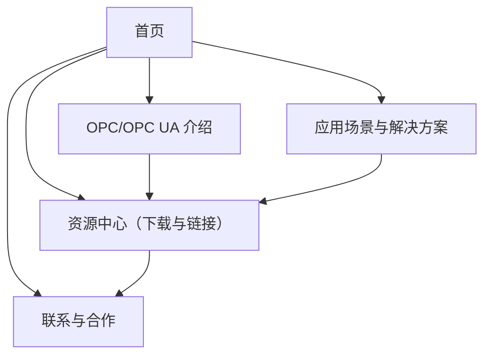

## 1. Product Overview
OPC 主题网站面向工业自动化从业者，提供 OPC/OPC UA 基础介绍、互操作要点、典型场景与资源下载。  
目标是降低理解与落地门槛，帮助你快速评估与集成 OPC UA。

## 2. Core Features

### 2.1 User Roles
本产品为公开信息站点，不区分用户角色。

### 2.2 Feature Module
我们的网站需求由以下主要页面组成：
1. **首页**：核心价值介绍、快速导航、关键概念入口、推荐资源与最新动态。
2. **OPC/OPC UA 介绍**：概念与术语、架构与通信模型、安全机制概览、互操作与信息模型要点。
3. **应用场景与解决方案**：典型行业场景、参考架构、实施清单、常见问题与排障思路。
4. **资源中心（下载与链接）**：白皮书/资料链接、示例与工具下载、兼容性与生态链接、版本与更新说明。
5. **联系与合作**：咨询表单、合作方式、基础信息与免责声明。

### 2.3 Page Details
| Page Name | Module Name | Feature description |
|-----------|-------------|---------------------|
| 首页 | 顶部导航与站点结构 | 提供到“介绍/场景/资源/联系”的主导航；显示当前所在位置（可选面包屑）。 |
| 首页 | Hero 与核心卖点 | 展示一句话定位、3–5 个核心价值点（互操作、安全、信息建模、扩展性等）；提供主 CTA（进入介绍/资源中心）。 |
| 首页 | 快速入口卡片 | 以卡片形式展示“术语速查/安全概览/数据建模/入门步骤/资源下载”入口。 |
| 首页 | 推荐内容与动态 | 展示推荐文章/最新资源（标题+摘要+更新时间）；支持跳转到对应详情锚点或页面。 |
| OPC/OPC UA 介绍 | 概念与术语 | 解释 OPC、OPC UA 的定位；给出 Client/Server、PubSub、Endpoint、Node、Namespace 等基础术语说明。 |
| OPC/OPC UA 介绍 | 架构与通信模型 | 说明 UA 的主要通信方式（Client/Server 与 PubSub）及适用场景；给出高层流程示意。 |
| OPC/OPC UA 介绍 | 信息模型与地址空间 | 说明 Address Space、NodeClass、Reference、Type System 的作用；给出最小示例结构（概念级）。 |
| OPC/OPC UA 介绍 | 安全机制概览 | 说明证书、信任链、加密/签名、用户认证（匿名/用户名密码/证书等）的概念与实施要点；列出常见误区。 |
| OPC/OPC UA 介绍 | 互操作与合规要点 | 描述互操作关注点（命名空间、数据类型、浏览/订阅行为一致性）；给出验收清单（概念级）。 |
| 应用场景与解决方案 | 场景目录 | 提供按行业/目标（采集、上云、边缘网关、MES/SCADA 集成）浏览的场景列表。 |
| 应用场景与解决方案 | 场景详情模板 | 每个场景包含：问题背景、推荐通信模式、数据建模建议、安全建议、部署拓扑（概念级）、注意事项。 |
| 应用场景与解决方案 | 参考架构 | 展示 2–3 个典型参考架构（设备侧、网关侧、平台侧）并标注数据流与边界。 |
| 应用场景与解决方案 | FAQ 与排障 | 提供常见问题与排障路径（证书不信任、时间不同步、订阅丢数、命名空间冲突等），按症状检索。 |
| 资源中心（下载与链接） | 资源列表与筛选 | 展示资源卡片（标题、类型、标签、更新时间、来源链接）；支持按类型/标签筛选与关键词搜索。 |
| 资源中心（下载与链接） | 资源详情与下载 | 展示资源简介、适用对象、版本信息、校验信息（如哈希可选）；提供外链跳转与文件下载。 |
| 资源中心（下载与链接） | 生态与兼容性链接 | 汇总常用工具、SDK、测试与互操作相关入口链接（以外链为主）。 |
| 联系与合作 | 咨询表单 | 提交姓名/公司/邮箱/主题/内容；提交后提示成功与预计回复时间；基础反垃圾（限流/蜜罐字段）。 |
| 联系与合作 | 站点信息 | 展示联系邮箱、工作时间、合作方向；提供免责声明与隐私说明（简版）。 |

## 3. Core Process
- 访客从首页进入：通过导航或快速入口进入“OPC/OPC UA 介绍”，建立基础概念与安全/建模认知。
- 访客进一步评估落地：进入“应用场景与解决方案”，按自身行业或目标选择场景，查看推荐通信模式与参考架构，并按实施清单自检。
- 访客获取资料与工具：进入“资源中心”，通过筛选/搜索找到所需资源，查看详情后下载文件或跳转到官方来源链接。
- 访客发起合作咨询：在“联系与合作”填写表单提交，获取确认提示并等待回复。

