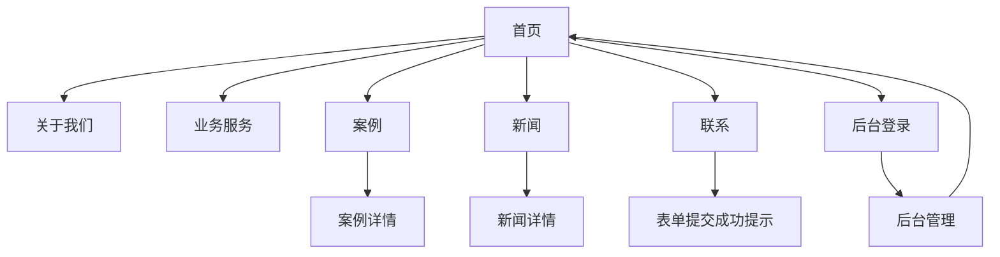

## 1. Product Overview
面向“一人有限责任公司”的企业官网，用于对外展示公司信息、业务能力与案例，并提供新闻发布与客户咨询收集。
包含基础后台内容管理（CMS），支持管理员维护官网内容，减少对技术人员的依赖。

## 2. Core Features

### 2.1 User Roles
| 角色 | 注册/登录方式 | 核心权限 |
|------|----------------|----------|
| 访客 | 无需注册 | 浏览官网内容；提交联系表单咨询 |
| 管理员 | 后台邮箱/密码登录 | 管理“关于/业务/案例/新闻/站点信息”；查看联系表单线索 |

### 2.2 Feature Module
官网与后台需求包含以下主要页面：
1. **首页**：品牌首屏、核心业务入口、精选案例、新闻摘要、联系入口。
2. **关于我们**：公司介绍、资质/优势、发展历程（可选精简）、团队/文化（可选）。
3. **业务服务**：业务列表、单项服务详情（在同页展开/跳转）。
4. **案例**：案例列表、筛选/标签、案例详情。
5. **新闻**：新闻列表、新闻详情。
6. **联系**：联系信息、地图/地址、在线咨询表单。
7. **后台登录**：管理员登录、退出。
8. **后台管理**：内容列表与编辑（关于/业务/案例/新闻）、媒体素材上传、线索查看、站点信息配置。

### 2.3 Page Details
| Page Name | Module Name | Feature description |
|-----------|-------------|---------------------|
| 首页 | 顶部导航与页脚 | 展示导航（首页/关于/业务/案例/新闻/联系）；提供页脚基础信息与快捷入口 |
| 首页 | 品牌首屏（Hero） | 展示公司名称/一句话定位/核心优势；提供“咨询/联系”主按钮 |
| 首页 | 业务入口 | 展示 3–6 个核心业务卡片；点击进入“业务服务”并定位到对应条目 |
| 首页 | 精选案例 | 展示 3–6 个案例摘要；点击进入案例详情 |
| 首页 | 新闻摘要 | 展示最新 3–5 条新闻；点击进入新闻详情 |
| 关于我们 | 公司介绍 | 展示公司简介、经营范围概述、关键资质/证照（图片） |
| 关于我们 | 核心优势 | 展示 3–6 条优势点（图标+文案） |
| 业务服务 | 业务列表 | 展示服务清单（名称/一句话描述/适用场景）；支持展开查看详情或跳转详情锚点 |
| 案例 | 案例列表 | 展示案例卡片（封面/行业/地点/时间/摘要）；支持按标签筛选（如行业/服务类型） |
| 案例 | 案例详情 | 展示背景-方案-结果结构化内容；支持图片画廊/附件下载（可选） |
| 新闻 | 新闻列表 | 展示新闻标题/摘要/发布时间；支持按年份或分类筛选（可选精简） |
| 新闻 | 新闻详情 | 展示正文、封面图、发布时间；支持上一条/下一条跳转 |
| 联系 | 联系信息 | 展示电话/邮箱/地址/工作时间；支持一键复制与外链跳转（mailto/tel） |
| 联系 | 地图展示 | 展示地图或静态位置图；支持打开第三方地图导航 |
| 联系 | 在线咨询表单 | 收集姓名、电话/邮箱、咨询主题、内容；提交后给出成功提示 |
| 后台登录 | 登录表单 | 输入邮箱与密码登录；登录失败给出错误提示；支持退出 |
| 后台管理 | 内容管理（CRUD） | 管理“关于/业务/案例/新闻”条目：新建、编辑、发布/下线、排序；预览前台效果 |
| 后台管理 | 媒体素材 | 上传图片；生成可用链接并在内容编辑中插入 |
| 后台管理 | 线索管理 | 查看联系表单提交记录（时间/来源/状态）；标记已跟进/备注（可选精简为“已读/未读”） |
| 后台管理 | 站点信息 | 配置公司名称、Logo、页脚信息、SEO 默认信息、联系信息 |

## 3. Core Process
**访客流程**：
1) 进入首页快速了解公司定位与优势 → 2) 浏览业务与案例验证能力 → 3) 查看新闻了解动态 → 4) 在联系页提交咨询表单 → 5) 获得提交成功提示。

**管理员流程**：
1) 进入后台登录页完成登录 → 2) 在后台管理中维护业务/案例/新闻/关于内容与站点信息 → 3) 上传素材并在内容中引用 → 4) 查看联系表单线索并标记处理。

