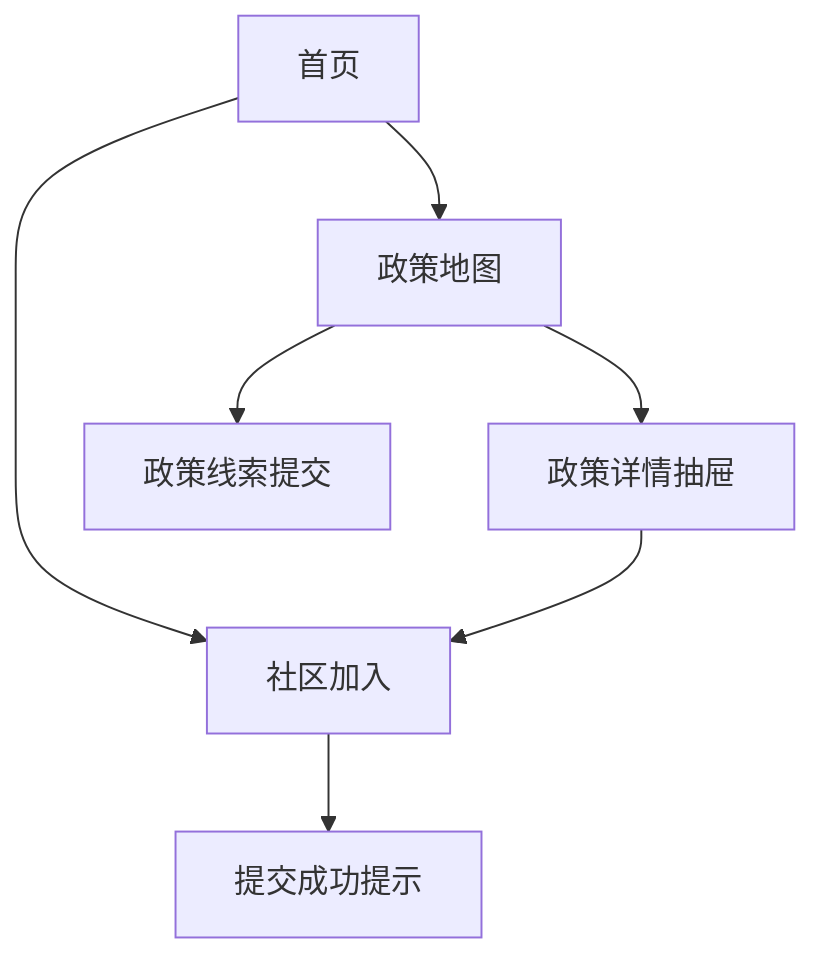

## 1. Product Overview
为“单人成军/一人公司”人群提供一个以 AI 为核心的行动型官网：用“政策地图”快速找到你能用的政策资源，并通过“社区加入”获得同伴与方法。
面向个体创业者、自由职业者、小团队负责人，帮助你更快完成从想法到落地的第一步。

## 2. Core Features

### 2.1 User Roles
本官网以内容与转化为主，不强制用户体系；运营侧通过后台（Supabase 控制台）维护内容与线索。

| 角色 | 注册方式 | 核心权限 |
|------|---------------------|------------------|
| 访客 | 无需注册 | 浏览首页内容、使用政策地图、提交社区加入表单 |
| 运营人员 | 通过 Supabase 控制台 | 维护政策数据、地区点位与标签、查看/导出线索 |

### 2.2 Feature Module
我们的官网需求由以下主要页面组成：
1. **首页**：核心叙事与价值主张、AI 能力介绍、政策地图入口、社区加入 CTA、精选政策与案例。
2. **政策地图**：地区/政策可视化地图、筛选检索、政策详情抽屉、收藏/分享、提交政策线索入口。
3. **社区加入**：社区定位与权益、加入流程、报名表单、常见问题与联系方式。

### 2.3 Page Details
| Page Name | Module Name | Feature description |
|-----------|-------------|---------------------|
| 首页 | 顶部导航与首屏叙事 | 展示“AI + 单人成军”一句话主张；提供明显入口到“政策地图/社区加入”；支持锚点滚动与当前页高亮。 |
| 首页 | AI 能力区块（叙事型） | 解释 AI 如何帮助个人公司：信息检索→拆解任务→行动清单；提供 1 个示例卡片（输入目标→输出行动步骤）。 |
| 首页 | 政策地图预览 | 展示 3–6 条“本周可用政策”与地区标签；点击进入政策地图并默认带入筛选条件（如“补贴/税务/人才/融资”）。 |
| 首页 | 社区加入转化区 | 展示社区收益（同伴、模板、复盘）；提供主要 CTA（去加入）与次要 CTA（订阅更新）。 |
| 首页 | 内容可信度区 | 展示“方法论/价值观/常见误解”三列信息；展示运营方联系方式与合规声明（信息来源说明）。 |
| 政策地图 | 地图与列表联动 | 在同屏展示地图（左）+ 列表（右）；地图点选高亮列表项，列表 hover 高亮地图点；支持缩放与当前位置定位（可选）。 |
| 政策地图 | 筛选与搜索 | 按地区、政策类型、适用人群、更新时间进行筛选；支持关键字搜索标题/要点；支持“清除筛选/保存当前筛选为链接”。 |
| 政策地图 | 政策详情抽屉 | 展示政策要点、适用条件、申请材料清单、截止时间、官方链接；支持一键复制摘要与分享链接。 |
| 政策地图 | 收藏与线索提交 | 允许访客在本地收藏（LocalStorage）并导出收藏清单；提供“我发现了新政策/更新”表单提交线索。 |
| 社区加入 | 社区说明与权益 | 说明“适合谁/不适合谁”；列出加入后可获得的内容（每周政策解读、AI 工作流模板、同伴互助）。 |
| 社区加入 | 加入流程 | 用 3 步流程展示：填写信息→收到确认→进入社区；提供预计响应时间与注意事项。 |
| 社区加入 | 报名表单（核心） | 收集必要字段：称呼、联系方式（邮箱/微信二选一）、所在城市、当前阶段、关注方向；提交后展示成功页内提示与后续动作。 |
| 社区加入 | FAQ 与合规 | 展示常见问题（隐私/广告/收费）；提供隐私说明（仅用于联系与服务改进）。 |

## 3. Core Process
- 访客流：访问首页 → 了解“AI + 单人成军”叙事 → 进入政策地图检索自己所在地区可用政策 → 打开政策详情并访问官方链接 → 若需要持续支持则进入社区加入页提交报名表单。
- 运营流：在后台维护政策与地区点位 → 定期更新“本周可用政策” → 查看社区报名线索并按城市/阶段跟进。

