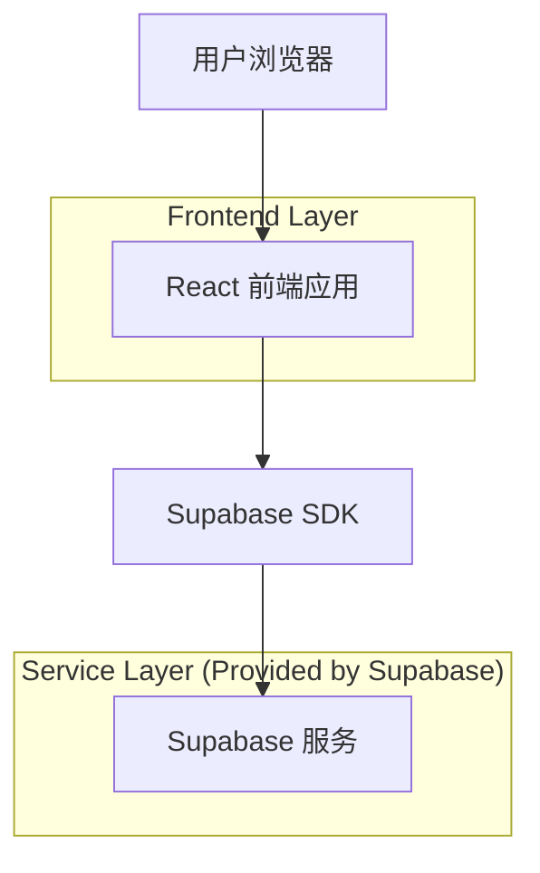
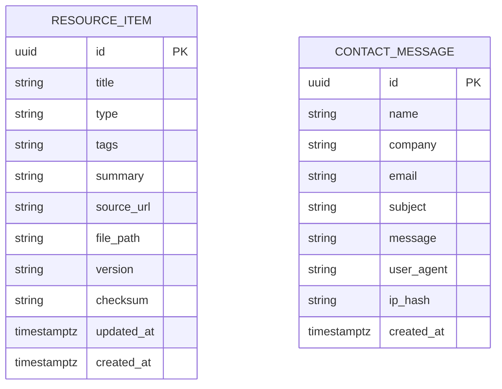

## 1.Architecture design


## 2.Technology Description
- Frontend: React@18 + react-router-dom@6 + tailwindcss@3 + vite
- Backend: Supabase（PostgreSQL + Storage）

## 3.Route definitions
| Route | Purpose |
|-------|---------|
| / | 首页：概览、导航、推荐内容入口 |
| /intro | OPC/OPC UA 介绍：概念、架构、信息模型、安全概览 |
| /solutions | 应用场景与解决方案：场景目录、参考架构、FAQ |
| /resources | 资源中心：筛选/搜索、资源详情、下载与外链 |
| /contact | 联系与合作：咨询表单、站点信息 |

## 6.Data model(if applicable)
### 6.1 Data model definition


### 6.2 Data Definition Language
Resource Table (resource_items)
```
-- create table
CREATE TABLE resource_items (
  id UUID PRIMARY KEY DEFAULT gen_random_uuid(),
  title TEXT NOT NULL,
  type TEXT NOT NULL, -- e.g. "doc" | "tool" | "sample" | "link"
  tags TEXT NOT NULL DEFAULT '',
  summary TEXT NOT NULL DEFAULT '',
  source_url TEXT NOT NULL DEFAULT '',
  file_path TEXT NOT NULL DEFAULT '', -- Supabase Storage 路径（可为空）
  version TEXT NOT NULL DEFAULT '',
  checksum TEXT NOT NULL DEFAULT '',
  updated_at TIMESTAMPTZ NOT NULL DEFAULT NOW(),
  created_at TIMESTAMPTZ NOT NULL DEFAULT NOW()
);

-- create index
CREATE INDEX idx_resource_items_type ON resource_items(type);
CREATE INDEX idx_resource_items_updated_at ON resource_items(updated_at DESC);

-- 권限（遵循 Supabase guideline：anon 读，authenticated 全权；本网站不要求登录，可按需启用）
GRANT SELECT ON resource_items TO anon;
GRANT ALL PRIVILEGES ON resource_items TO authenticated;
```

Contact Table (contact_messages)
```
-- create table
CREATE TABLE contact_messages (
  id UUID PRIMARY KEY DEFAULT gen_random_uuid(),
  name TEXT NOT NULL,
  company TEXT NOT NULL DEFAULT '',
  email TEXT NOT NULL,
  subject TEXT NOT NULL DEFAULT '',
  message TEXT NOT NULL,
  user_agent TEXT NOT NULL DEFAULT '',
  ip_hash TEXT NOT NULL DEFAULT '',
  created_at TIMESTAMPTZ NOT NULL DEFAULT NOW()
);

-- create index
CREATE INDEX idx_contact_messages_created_at ON contact_messages(created_at DESC);

-- 권限：允许匿名提交（insert），避免开放读取
GRANT INSERT ON contact_messages TO anon;
GRANT ALL PRIVILEGES ON contact_messages TO authenticated;
```

Storage Buckets（建议）
- bucket: `resources`：存放可下载文件（PDF/ZIP/示例代码等）。

安全与访问控制建议（最小集）
- 开启 RLS：
  - `resource_items`：允许 anon SELECT（公开资源）；仅 authenticated 可写入/更新。
  - `contact_messages`：允许 anon INSERT；拒绝 anon SELECT。
- 前端对表单提交做基础限流与蜜罐字段；服务端（RLS/函数）可按需加严。