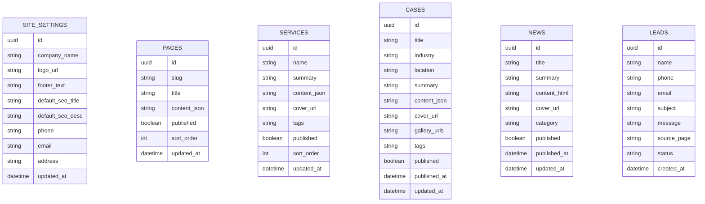

## 1.Architecture design
```mermaid
graph TD
  U["用户浏览器"] --> FE["React 前端应用（官网 + 后台）"]
  FE --> SBSDK["Supabase JS SDK"]
  SBSDK --> SBAUTH["Supabase Auth"]
  SBSDK --> SBDB["Supabase Database (PostgreSQL)"]
  SBSDK --> SBST["Supabase Storage"]

  subgraph "Frontend Layer"
    FE
  end

  subgraph "Service Layer (Provided by Supabase)"
    SBAUTH
    SBDB
    SBST
  end
end
```

## 2.Technology Description
- Frontend: React@18 + react-router + TypeScript + tailwindcss@3 + vite
- Backend: Supabase（Auth + PostgreSQL + Storage）

## 3.Route definitions
| Route | Purpose |
|-------|---------|
| / | 首页：品牌首屏、业务入口、精选案例、新闻摘要、联系入口 |
| /about | 关于我们：公司介绍、优势、资质展示 |
| /services | 业务服务：业务列表与单项详情展示 |
| /cases | 案例：案例列表与筛选 |
| /cases/:id | 案例详情：背景/方案/结果、图集 |
| /news | 新闻：新闻列表 |
| /news/:id | 新闻详情：正文与上下篇跳转 |
| /contact | 联系：联系信息、地图、咨询表单 |
| /admin/login | 后台登录：管理员认证 |
| /admin | 后台管理：内容管理、媒体上传、线索查看、站点信息 |

## 6.Data model(if applicable)

### 6.1 Data model definition


### 6.2 Data Definition Language
> 说明：为简化早期交付，这里使用“应用层逻辑外键”（不创建物理外键约束）。

Site settings（site_settings）
```sql
CREATE TABLE site_settings (
  id uuid PRIMARY KEY DEFAULT gen_random_uuid(),
  company_name text NOT NULL,
  logo_url text,
  footer_text text,
  default_seo_title text,
  default_seo_desc text,
  phone text,
  email text,
  address text,
  updated_at timestamptz NOT NULL DEFAULT now()
);

GRANT SELECT ON site_settings TO anon;
GRANT ALL PRIVILEGES ON site_settings TO authenticated;
```

Pages（pages）
```sql
CREATE TABLE pages (
  id uuid PRIMARY KEY DEFAULT gen_random_uuid(),
  slug text UNIQUE NOT NULL, -- about
  title text NOT NULL,
  content_json jsonb NOT NULL DEFAULT '{}'::jsonb,
  published boolean NOT NULL DEFAULT true,
  sort_order int NOT NULL DEFAULT 0,
  updated_at timestamptz NOT NULL DEFAULT now()
);

CREATE INDEX idx_pages_slug ON pages(slug);

GRANT SELECT ON pages TO anon;
GRANT ALL PRIVILEGES ON pages TO authenticated;
```

Services（services）
```sql
CREATE TABLE services (
  id uuid PRIMARY KEY DEFAULT gen_random_uuid(),
  name text NOT NULL,
  summary text,
  content_json jsonb NOT NULL DEFAULT '{}'::jsonb,
  cover_url text,
  tags text,
  published boolean NOT NULL DEFAULT true,
  sort_order int NOT NULL DEFAULT 0,
  updated_at timestamptz NOT NULL DEFAULT now()
);

CREATE INDEX idx_services_published_sort ON services(published, sort_order);

GRANT SELECT ON services TO anon;
GRANT ALL PRIVILEGES ON services TO authenticated;
```

Cases（cases）
```sql
CREATE TABLE cases (
  id uuid PRIMARY KEY DEFAULT gen_random_uuid(),
  title text NOT NULL,
  industry text,
  location text,
  summary text,
  content_json jsonb NOT NULL DEFAULT '{}'::jsonb,
  cover_url text,
  gallery_urls jsonb NOT NULL DEFAULT '[]'::jsonb,
  tags text,
  published boolean NOT NULL DEFAULT true,
  published_at timestamptz,
  updated_at timestamptz NOT NULL DEFAULT now()
);

CREATE INDEX idx_cases_published_at ON cases(published, published_at DESC);

GRANT SELECT ON cases TO anon;
GRANT ALL PRIVILEGES ON cases TO authenticated;
```

News（news）
```sql
CREATE TABLE news (
  id uuid PRIMARY KEY DEFAULT gen_random_uuid(),
  title text NOT NULL,
  summary text,
  content_html text NOT NULL,
  cover_url text,
  category text,
  published boolean NOT NULL DEFAULT true,
  published_at timestamptz,
  updated_at timestamptz NOT NULL DEFAULT now()
);

CREATE INDEX idx_news_published_at ON news(published, published_at DESC);

GRANT SELECT ON news TO anon;
GRANT ALL PRIVILEGES ON news TO authenticated;
```

Leads（leads）
```sql
CREATE TABLE leads (
  id uuid PRIMARY KEY DEFAULT gen_random_uuid(),
  name text,
  phone text,
  email text,
  subject text,
  message text NOT NULL,
  source_page text,
  status text NOT NULL DEFAULT 'new', -- new/processing/done
  created_at timestamptz NOT NULL DEFAULT now()
);

CREATE INDEX idx_leads_created_at ON leads(created_at DESC);

-- 线索通常不应对匿名访客开放读取
GRANT INSERT ON leads TO anon;
GRANT ALL PRIVILEGES ON leads TO authenticated;
```

补充建议（权限与安全，供实现时参考）：
- 使用 Supabase Auth 的邮箱/密码为管理员创建账号；前台匿名访问走 anon key。
- 开启 RLS：对内容表允许 anon 只读（仅 published=true），对 leads 表仅允许 anon 插入，管理员 authenticated 全量读写。