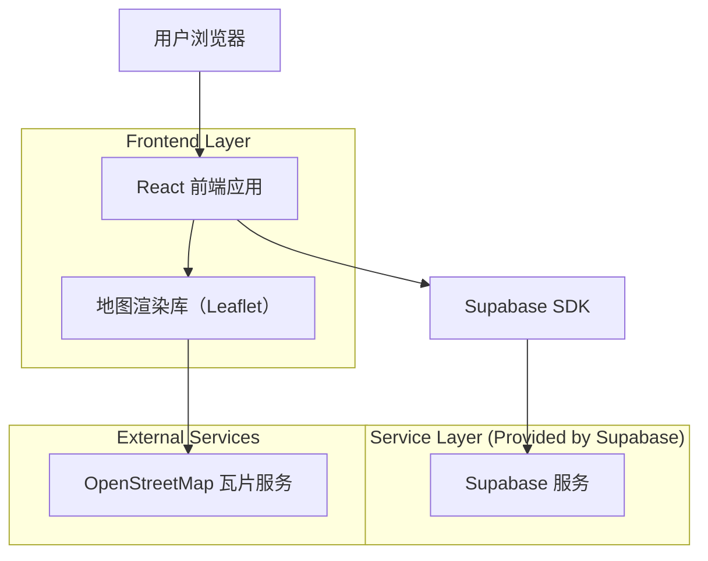
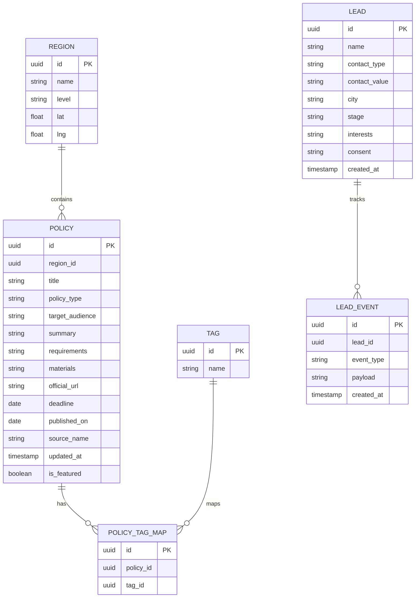

## 1.Architecture design


## 2.Technology Description
- Frontend: React@18 + vite + TypeScript + tailwindcss@3 + react-router-dom
- Backend: Supabase（PostgreSQL + Storage；使用 Supabase JS SDK 直连）
- Map: leaflet（基于 OpenStreetMap 瓦片）

## 3.Route definitions
| Route | Purpose |
|-------|---------|
| / | 首页：核心叙事、AI 价值、入口与转化 |
| /policy-map | 政策地图：地图+列表、筛选搜索、政策详情 |
| /community | 社区加入：权益说明、加入流程、报名表单 |

## 6.Data model(if applicable)

### 6.1 Data model definition


### 6.2 Data Definition Language
Region Table (regions)
```
CREATE TABLE regions (
  id UUID PRIMARY KEY DEFAULT gen_random_uuid(),
  name TEXT NOT NULL,
  level TEXT NOT NULL CHECK (level IN ('country','province','city','district')),
  lat DOUBLE PRECISION,
  lng DOUBLE PRECISION
);

GRANT SELECT ON regions TO anon;
GRANT ALL PRIVILEGES ON regions TO authenticated;
```

Policy Table (policies)
```
CREATE TABLE policies (
  id UUID PRIMARY KEY DEFAULT gen_random_uuid(),
  region_id UUID,
  title TEXT NOT NULL,
  policy_type TEXT NOT NULL,
  target_audience TEXT,
  summary TEXT,
  requirements TEXT,
  materials TEXT,
  official_url TEXT,
  deadline DATE,
  published_on DATE,
  source_name TEXT,
  updated_at TIMESTAMPTZ DEFAULT NOW(),
  is_featured BOOLEAN DEFAULT FALSE
);

CREATE INDEX idx_policies_region_id ON policies(region_id);
CREATE INDEX idx_policies_updated_at ON policies(updated_at DESC);

GRANT SELECT ON policies TO anon;
GRANT ALL PRIVILEGES ON policies TO authenticated;
```

Tags (tags) & Mapping (policy_tag_map)
```
CREATE TABLE tags (
  id UUID PRIMARY KEY DEFAULT gen_random_uuid(),
  name TEXT UNIQUE NOT NULL
);

CREATE TABLE policy_tag_map (
  id UUID PRIMARY KEY DEFAULT gen_random_uuid(),
  policy_id UUID NOT NULL,
  tag_id UUID NOT NULL
);

CREATE INDEX idx_policy_tag_map_policy_id ON policy_tag_map(policy_id);
CREATE INDEX idx_policy_tag_map_tag_id ON policy_tag_map(tag_id);

GRANT SELECT ON tags TO anon;
GRANT SELECT ON policy_tag_map TO anon;
GRANT ALL PRIVILEGES ON tags TO authenticated;
GRANT ALL PRIVILEGES ON policy_tag_map TO authenticated;
```

Leads (leads) & Events (lead_events)
```
CREATE TABLE leads (
  id UUID PRIMARY KEY DEFAULT gen_random_uuid(),
  name TEXT,
  contact_type TEXT NOT NULL CHECK (contact_type IN ('email','wechat')),
  contact_value TEXT NOT NULL,
  city TEXT,
  stage TEXT,
  interests TEXT,
  consent TEXT,
  created_at TIMESTAMPTZ DEFAULT NOW()
);

CREATE TABLE lead_events (
  id UUID PRIMARY KEY DEFAULT gen_random_uuid(),
  lead_id UUID NOT NULL,
  event_type TEXT NOT NULL,
  payload JSONB,
  created_at TIMESTAMPTZ DEFAULT NOW()
);

CREATE INDEX idx_leads_created_at ON leads(created_at DESC);
CREATE INDEX idx_lead_events_lead_id ON lead_events(lead_id);

-- 线索数据默认不对 anon 开放写入（可通过 Supabase RLS 策略控制“仅允许插入”）。
GRANT ALL PRIVILEGES ON leads TO authenticated;
GRANT ALL PRIVILEGES ON lead_events TO authenticated;
```